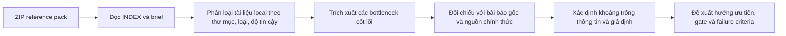
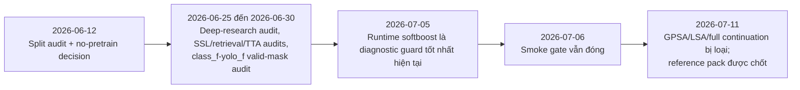
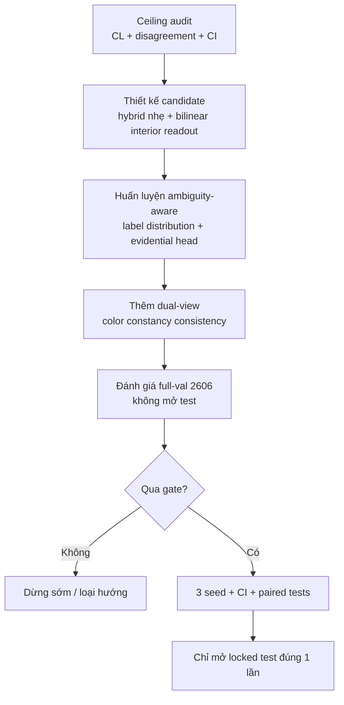

# Nghiên cứu chuyên sâu về bộ bài toán TRKH 5-class từ gói ZIP tham chiếu

## Tóm tắt điều hành

Tôi đã truy cập và mở trực tiếp được gói ZIP trong phiên làm việc này. Khi đối chiếu với `README_INDEX.md` và problem brief, có thể xác nhận đây là một “snapshot tự chứa” của bài toán TRKH 5-class, gồm tài liệu phương pháp, snapshot code hiện tại, metadata cho hai view dữ liệu `class_f` và `yolo_f`, bằng chứng baseline/gate, các hướng gần đây đã bị loại, ví dụ XAI, và metadata của đối thủ AIDT. Gói này **không** đóng gói checkpoint `.pt`, raw image dataset, full row-level manifests, hay PDF ngoài; do đó đây là một bộ tham chiếu nghiên cứu chứ không phải một bản sao đầy đủ để huấn luyện lại end-to-end độc lập. fileciteturn0file1L5-L10 fileciteturn0file1L41-L58 fileciteturn0file1L107-L122

Vấn đề trung tâm của TRKH không phải là “thiếu thêm một adapter locality” hay “thiếu một threshold/router tốt hơn”, mà là một nút thắt có cấu trúc: lớp 1 vừa hiếm, vừa nằm đúng vùng biên ngữ nghĩa giữa lớp 0, 2 và 4; trong khi pack hiện không có annotation guideline chi tiết, không có inter-rater agreement, không có confidence theo nhãn, và không có ước lượng Bayes/annotator ceiling. Điều này làm cho mục tiêu F1 > 0.98 ở **mọi lớp** trở thành một mục tiêu hiện chưa được chứng minh là khả thi về mặt thông tin, chứ không chỉ khó về mặt kiến trúc. fileciteturn0file0L9-L26 fileciteturn0file0L113-L135 fileciteturn0file0L440-L447

Theo snapshot local, keeper no-pretrain hiện đạt macro/class-1 F1 khoảng `0.8847/0.6860` trên full validation `yolo_f/val=2606`, còn runtime softboost đạt `0.8887/0.7030`; raw locked test đạt `0.8865/0.6667`. Với lớp 1, để chạm F1 `0.98`, brief nêu rõ cần cứu toàn bộ `35` FN và đồng thời loại ít nhất `57/63` FP hiện có. Nghĩa là mọi cải tiến kiểu “sửa vài mẫu” hoặc “dịch nhẹ precision-recall trade-off” là không đủ về quy mô. fileciteturn0file0L40-L57 fileciteturn0file0L68-L75 fileciteturn0file1L25-L35

Đối chiếu với văn liệu khoa học cho thấy bốn hướng có xác suất thành công cao nhất không nằm ở chỗ lặp lại SPT/GPSA/LSA hay các verifier hậu kiểm, mà ở: một backbone hybrid CNN-Transformer thực sự data-efficient theo kiểu CoAtNet/MobileViT/EdgeNeXt; một readout fine-grained mô hình hóa tương tác cục bộ mạnh hơn bằng bilinear/second-order pooling; một đầu ra ambiguity-aware cho class 1 dựa trên label distribution hoặc evidential/Dirichlet uncertainty; và một pipeline học bất biến chiếu sáng theo color constancy thay vì chỉ color jitter chung chung. Các hướng này phù hợp hơn với bằng chứng local rằng mô hình hiện “đã nhìn đúng quả” nhưng chưa “nhìn đúng thuộc tính bề mặt bên trong”, đồng thời còn bị nhiễu bởi border/stem/endpoint và illumination/style. fileciteturn0file0L222-L237 fileciteturn0file0L384-L405 citeturn19academia1turn10academia2turn4academia0turn19academia2turn16academia0turn1academia2turn1academia3turn8academia0turn8academia1

Kết luận thực dụng nhất là: trước khi mở thêm một vòng full train 30 epoch, TRKH nên chuyển câu hỏi nghiên cứu từ “có thêm module nào tăng F1 class 1 không?” sang “trần hiệu năng thực tế là bao nhiêu, cue phân biệt nào còn chưa được mô hình hóa, và uncertainty nào phải được mô hình hóa ngay trong head thay vì đẩy sang threshold/router?”. Về ưu tiên triển khai, tôi xếp: **ước lượng ceiling + ambiguity-aware head + interior-aware bilinear readout** là nhóm ưu tiên cao nhất; **illumination-invariant dual-view consistency** là ưu tiên tiếp theo; **teacher/distillation transition-aware với abstention** là hướng hỗ trợ, không nên là trục chính. fileciteturn0file0L542-L575 fileciteturn0file0L578-L649 citeturn18academia1turn18academia0turn17academia0turn7academia1

## Phương pháp và phạm vi

Phân tích này dùng hai lớp nguồn. Lớp thứ nhất là nguồn local: tôi mở trực tiếp ZIP, đọc `README_INDEX.md`, problem brief, và kiểm tra cấu trúc thư mục, loại tệp, manifest, code snapshot, evidence JSON/CSV/PNG. Lớp thứ hai là nguồn ngoài: tôi ưu tiên bài báo gốc và nguồn chính thức về hybrid CNN-Transformer, fine-grained recognition, uncertainty/ambiguity modeling, calibration, selective prediction, color constancy, và label-noise diagnostics. Khi nguồn domain-specific cho bài toán xoài 5 lớp không đủ mạnh hoặc không nhất quán, tôi ưu tiên lý thuyết nền và công trình gốc trong CV/ML hơn là các bài ứng dụng yếu hơn. fileciteturn0file1L14-L21 fileciteturn0file1L94-L105 citeturn19academia1turn10academia2turn4academia0turn19academia2turn15academia3turn1academia2turn1academia3turn18academia1

Về độ tin cậy, tôi phân hạng local evidence theo hướng sau. `JSON/CSV/YAML` sinh ra trực tiếp từ run, config, metrics, split metadata và manifest được xem là **độ tin cậy nội bộ cao** cho việc tái hiện đúng trạng thái hệ thống. `Markdown` audit/journal/README là **trung bình-cao** vì chúng chứa diễn giải của nhóm nghiên cứu nhưng vẫn là nguồn sơ cấp cục bộ. `PNG` XAI/contact sheet là **nguồn hỗ trợ**, hữu ích để hiểu pattern lỗi nhưng không nên dùng đơn lẻ cho kết luận nhân quả. Snapshot code trong `03_current_model_code` và `08_competitor_aidt/source` được đánh dấu **một phần local-only**, vì pack index nói rõ current code là snapshot so với commit đối chiếu và chưa chắc đã phản ánh đầy đủ trạng thái trên GitHub. fileciteturn0file1L52-L58 fileciteturn0file1L115-L122

Tôi dùng “local-only” theo nghĩa thực dụng: tệp nào chỉ tồn tại dưới dạng bằng chứng snapshot nội bộ hoặc run artifact trong gói này thì đánh dấu **Có**; tệp nào là snapshot local của code có thể có đối chiếu công khai hoặc commit upstream thì đánh dấu **Một phần**. Cách đánh dấu này phù hợp với mô tả pack rằng snapshot hiện tại có nội dung chưa được push đầy đủ và không nên giả định GitHub đã chứa cùng trạng thái. fileciteturn0file1L115-L122

## Phát hiện cốt lõi từ gói local

Ràng buộc kỹ thuật của bài toán rất chặt: không thêm dữ liệu thô mới, không sửa ảnh/nhãn/raw dataset, không dùng test để chọn kiến trúc hay threshold, mọi smoke/probe phải dùng full validation 2606 object, phần cứng triển khai chỉ có RTX 4060 Laptop 8 GiB, RAM 16 GiB, batch hiệu dụng quanh `32`, `grad accumulation=2`, `image size=256`, tối đa 30 epoch. Tập ràng buộc này loại trừ phần lớn các chiến lược dựa vào tiền huấn luyện lớn hoặc kiểm tra liên tục trên test. fileciteturn0file0L15-L26

Dữ liệu local cho thấy vấn đề không chỉ là mất cân bằng lớp. Brief nêu hai view dữ liệu `class_f` và `yolo_f` chưa có kết luận canonical tuyệt đối; chúng khác format, ngữ cảnh, coordinate frame, số object và split logic. Trên train còn có nhiều ảnh multi-object/mixed-label, trong khi validation gần như không có và test hoàn toàn single-object, khiến source-level context có nguy cơ học shortcut mà không generalize. Ngoài ra, bbox tồn tại ở hai coordinate frame (`bbox` và `crop_bbox`), và “đúng hệ tọa độ” không đồng nghĩa “hữu ích downstream”, vì việc đổi prior từ `bbox` sang `crop_bbox` từng làm giảm điểm. fileciteturn0file0L97-L109 fileciteturn0file0L138-L149 fileciteturn0file0L165-L176

Lớp 1 là nút thắt chính nhưng không phải nút thắt duy nhất. Validation chỉ có `151` mẫu lớp 1, trong khi các lớp lớn có `544–712` mẫu; hơn nữa lớp 1 lại chồng lấn mạnh với lớp 0, 2 và 4 theo màu, độ chín không đồng đều và pattern khuyết tật. Chính brief cũng nhấn mạnh chưa có annotation guideline biên `0↔1`, `1↔2`, `1↔4`, chưa có số annotator hay inter-rater agreement, và chưa có ước lượng irreducible label noise/Bayes error. Đây là dấu hiệu rất mạnh rằng class-1 có thể là một **vùng biên bất định**, không phải một lớp “sạch” kiểu mutually exclusive theo quan sát thị giác hiện tại. fileciteturn0file0L113-L135

Ở phía mô hình, brief cho thấy keeper hiện bị khóa trong precision-recall trade-off của class 1: raw keeper có recall cao hơn nhưng precision thấp; runtime softboost tăng precision nhưng làm recall giảm. XAI cũng cho thấy chẩn đoán đơn giản “mô hình chỉ nhìn nền” là không còn đúng: foreground attention mass cao, background perturbation nhỏ, nhưng Grad-CAM/rollout vẫn bám border, stem, endpoint, padding và vùng màu rộng; continuation mới nhất vẫn nhạy với object color và không học được interior-surface cue mới. Nói ngắn gọn: mô hình có localization tương đối ổn, nhưng representation cho thuộc tính quyết định class 1 còn sai mục tiêu. fileciteturn0file0L201-L218 fileciteturn0file0L222-L237 fileciteturn0file0L325-L338 fileciteturn0file0L384-L405

Pack index và brief cũng rất rõ rằng nhiều hướng đã bị loại trên keeper hiện tại: SPT, GPSA, LSA, simple context fusion, blur/gray background suppression, same-source consistency, current-embedding kNN/centroids/Mahalanobis, verifier/router sweeps và nhiều KD route. Do đó một đề xuất nghiên cứu có giá trị phải khác **về cơ chế tín hiệu**, không phải chỉ đổi hyperparameter quanh cùng signal. fileciteturn0file1L66-L76 fileciteturn0file0L492-L537

Bảng dưới đây tóm tắt phần so sánh local quan trọng nhất.

| Hạng mục | Evidence local | Hàm ý nghiên cứu |
|---|---|---|
| Mục tiêu chính thức | F1 > 0.98 cho từng lớp, không pretrained phụ thuộc khi triển khai, tối đa 30 epoch | Mọi đề xuất phải thỏa ràng buộc compute và fairness protocol, không chỉ tăng điểm rời rạc. fileciteturn0file0L9-L26 |
| Keeper hiện tại | `7.25M` tham số; validation raw `0.8847/0.6860`; runtime softboost `0.8887/0.7030`; raw locked test `0.8865/0.6667` | Khoảng cách từ hiện trạng tới mục tiêu là rất lớn; cần thay đổi representation, không chỉ hậu kiểm logits. fileciteturn0file0L35-L57 |
| Correction budget class 1 | `TP=116, FP=63, FN=35`; muốn lên `0.98` phải cứu cả `35` FN và loại `57/63` FP | Các thay đổi kiểu threshold/router nhỏ là bất tương xứng với quy mô lỗi. fileciteturn0file0L61-L75 |
| Dataset ambiguity | `class_f` và `yolo_f` chưa canonical; không có inter-rater/noise ceiling | Cần chẩn đoán ceiling và ambiguity trước khi đòi hỏi F1 0.98. fileciteturn0file0L97-L109 fileciteturn0file0L123-L135 |
| XAI hiện tại | Foreground cao nhưng border/stem/crop cue vẫn còn; continuation bị loại vì vẫn phụ thuộc color cục bộ | Hướng mới phải ép representation vào interior-surface thực sự. fileciteturn0file0L222-L237 fileciteturn0file0L331-L338 |
| Evaluation risk | AIDT/TRKH chưa apples-to-apples; thiếu nhiều seed, bootstrap CI và significance | Bài báo/benchmark chưa đủ mạnh nếu không sửa protocol đánh giá. fileciteturn0file0L409-L439 |

## Đối chiếu với văn liệu khoa học

Về kiến trúc, bằng chứng từ CoAtNet cho thấy việc **xếp chồng có nguyên tắc** các block tích chập rồi mới tới attention giúp cải thiện generalization, đặc biệt khi dữ liệu không lớn như ImageNet-21K hay JFT không khả dụng. MobileViT và EdgeNeXt đi theo cùng trực giác nhưng theo hướng nhẹ hơn cho mobile/edge: MobileViT báo cáo khoảng 6 triệu tham số và EdgeNeXt có biến thể 5.6 triệu tham số, cho thấy hoàn toàn có một vùng thiết kế hybrid CNN-Transformer vừa với ngân sách cỡ TRKH mà không phải nhảy sang backbone trăm triệu tham số như AIDT. Điểm quan trọng là các mô hình này không đơn giản là “gắn local attention” lên ViT hiện có; chúng thay đổi **cách phân vai** giữa conv và attention ngay từ trong backbone. citeturn19academia1turn10academia2turn4academia0

Về fine-grained recognition, dòng bilinear pooling đặc biệt đáng chú ý hơn nhiều so với các thử nghiệm locality adapter đã bị loại trong pack. Bilinear CNNs mô hình hóa outer-product của local features để nắm các tương tác tinh vi giữa texture/part cues; các biến thể low-rank và hierarchical bilinear cho thấy có thể giữ được lợi ích này trong khi giảm mạnh chi phí tính toán và số tham số. Với bối cảnh TRKH, đây là một gợi ý trực tiếp: thay vì cố ép attention hiện có “sắc hơn”, nên cân nhắc một readout bậc hai gọn nhẹ trên **interior tokens/patches** để tăng sức phân biệt cho cue bề mặt-nội phần, vốn là thứ local brief nói rằng đang thiếu. fileciteturn0file0L208-L218 citeturn19academia2turn15academia3turn16academia0

Về localization trong fine-grained và bài toán dữ liệu ít, các công trình về discriminative localization và saliency cho thấy việc hướng mô hình vào vùng phân biệt mà **không cần part annotation đầy đủ** có thể cải thiện phân loại, đặc biệt trong miền khan hiếm dữ liệu. Điều này rất khớp với bối cảnh TRKH: pack đã có bbox, crop, XAI audit và bằng chứng rằng foreground mass cao nhưng cue quyết định vẫn sai. Nói cách khác, hướng đúng không phải “thêm một objectness head đơn giản” như tuyến đã loại, mà là dùng supervision yếu từ bbox/crop để tách **interior vs boundary vs context** như những vai trò học khác nhau. fileciteturn0file0L578-L588 citeturn9academia1turn9academia2turn19academia0

Về ambiguity và uncertainty, DLDL cho thấy biến nhãn thành một **phân bố nhãn** có thể tận dụng thông tin mơ hồ giữa các lớp lân cận và giảm overfitting khi tập dữ liệu nhỏ; Evidential Deep Learning thì đặt phân bố Dirichlet lên xác suất lớp để mô hình hóa uncertainty trực tiếp; còn Kendall–Gal tách bạch aleatoric uncertainty với epistemic uncertainty và chỉ ra lợi ích của việc mô hình hóa nhiễu quan sát. Với class 1 của TRKH — vốn vừa ít mẫu, vừa nằm ở đường biên ngữ nghĩa, lại chưa có inter-rater data — hướng ambiguity-aware như vậy khớp với bản chất bài toán hơn hẳn một head one-hot thông thường cộng threshold hậu kiểm. fileciteturn0file0L123-L135 fileciteturn0file0L564-L575 citeturn1academia2turn1academia3turn4academia3

Về label-quality diagnostics, Confident Learning là nguồn nền tảng quan trọng vì nó ước lượng joint distribution giữa nhãn quan sát và nhãn “sạch” không biết trước, giúp phát hiện class overlap và label errors một cách model-agnostic; công trình tiếp theo về label errors trong benchmark còn cho thấy ngay cả các test set rất phổ biến cũng có thể chứa tỷ lệ lỗi đủ để đảo thứ hạng mô hình. Đặt cạnh local brief — nơi chưa có guideline, chưa có inter-rater, và chính nhóm nghiên cứu nghi ngờ ceiling có thể thấp hơn 0.98 — kết luận hợp lý là TRKH **phải** có một pha ước lượng label-noise/ceiling trước khi đầu tư nặng vào full retrain. fileciteturn0file0L123-L135 fileciteturn0file0L440-L447 citeturn18academia1turn18academia0

Về calibration và selective prediction, Dirichlet calibration cho thấy multiclass probabilities có thể được hiệu chỉnh tốt hơn temperature scaling bằng một phép biến đổi natively multiclass; SelectiveNet đưa reject option ngay vào mạng thay vì threshold confidence hậu kiểm. Hai kết quả này rất hợp với cảnh báo của local pack rằng runtime softboost chỉ là diagnostic guard và nhiều threshold/verifier đang đứng trên validation evidence. Nếu TRKH cần “bảo vệ recall class 1 trong khi chặn FP 0/2/4→1”, cách khoa học hơn là gắn calibrated uncertainty/selective risk ngay trong mô hình và đánh giá theo risk-coverage, thay vì tiếp tục tinh chỉnh router trên validation. fileciteturn0file0L285-L292 fileciteturn0file0L424-L439 citeturn7academia1turn17academia0turn17academia1

Về màu sắc và chiếu sáng, local XAI cho thấy object color vừa là tín hiệu hợp lệ vừa là shortcut, còn blur/gray background không giải quyết được vì shortcut nằm sát boundary hoặc trên chính bề mặt quả. Literature về semantic color constancy và contrastive learning for color constancy cho thấy việc mô hình hóa illuminant/cast color một cách có cấu trúc có thể tăng robustness tốt hơn nhiều so với augmentation màu đơn thuần. Điều này gợi ý một hướng rất cụ thể cho TRKH: học nhất quán giữa ảnh gốc và ảnh đã canonicalize illumination/white-balance, nhưng chỉ trên interior-focused representation, để tách “màu phản ánh độ chín” khỏi “màu do ánh sáng/camera/source style”. fileciteturn0file0L388-L405 fileciteturn0file0L603-L614 citeturn8academia1turn8academia0

Bảng so sánh dưới đây tổng hợp các khớp nối quan trọng giữa local evidence và literature.

| Bottleneck local | Bằng chứng local | Cơ chế khoa học phù hợp | Vì sao khác các tuyến đã bị loại |
|---|---|---|---|
| Thiếu cue interior-surface | Attention vào foreground cao nhưng border/stem vẫn chi phối | Low-rank/hierarchical bilinear pooling trên vùng interior; discriminative localization | Khác SPT/GPSA/LSA vì không sửa attention “chung”, mà tăng sức biểu diễn tương tác cục bộ bậc hai. fileciteturn0file0L222-L237 citeturn19academia2turn16academia0turn9academia1 |
| Class 1 mơ hồ, ít mẫu | 151 mẫu val; overlap 0/2/4; thiếu inter-rater | Label distribution learning + evidential head | Khác ordinal loss đơn giản và hậu kiểm threshold vì ambiguity được mô hình hóa ngay trong nhãn/đầu ra. fileciteturn0file0L113-L135 citeturn1academia2turn1academia3 |
| Teacher mạnh ở FP suppression nhưng yếu ở FN rescue | External support thiếu coverage `1→2`, `1→4` | Per-transition calibrated distillation + abstention/selective risk | Khác KD confidence toàn cục vì trọng số teacher dựa trên độ tin cậy theo transition. fileciteturn0file0L592-L599 fileciteturn0file0L371-L378 citeturn7academia1turn17academia0 |
| Color vừa là signal vừa là shortcut | Desaturation ảnh hưởng lớn; background blur nhỏ | Dual-view color-constancy consistency | Khác blur/gray suppression hay color jitter chung, vì mô hình hóa illuminant một cách có cấu trúc. fileciteturn0file0L390-L405 citeturn8academia1turn8academia0 |
| Mục tiêu 0.98 có thể vượt ceiling | Không có guideline/noise ceiling/annotator stats | Confident learning + benchmark label-error diagnostics | Khác “đoán trần bằng cảm giác”; đây là một bước đo lường cần chạy trước full train lớn. fileciteturn0file0L123-L135 fileciteturn0file0L440-L447 citeturn18academia1turn18academia0 |

## Khoảng trống thông tin, giả định và giới hạn

Khoảng trống lớn nhất không nằm ở literature mà nằm ở chính ngữ cảnh local còn thiếu để diễn giải dữ liệu. Từ pack index và brief, tôi xác định ít nhất tám khoảng trống còn mở: thiếu raw images; thiếu row-level manifests đầy đủ; thiếu checkpoint/optimizer/EMA; thiếu annotation guideline chi tiết cho biên `0↔1`, `1↔2`, `1↔4`; thiếu số annotator và inter-rater agreement; thiếu confidence theo nhãn hoặc attribute labels được xác nhận; thiếu mapping canonical tuyệt đối giữa `class_f` và `yolo_f`; và thiếu protocol nhiều-seed với bootstrap significance cho candidate cuối. Mỗi khoảng trống này đều trực tiếp ảnh hưởng đến việc diễn giải đúng local evidence. fileciteturn0file1L107-L122 fileciteturn0file0L97-L109 fileciteturn0file0L123-L135 fileciteturn0file0L430-L447

Tôi phải dùng một số giả định để hoàn thành báo cáo này. Thứ nhất, tôi giả định protocol lựa chọn mô hình hiện nên tiếp tục bám `yolo_f/val=2606` ở mức object-level, vì brief liên tục dùng split này làm chuẩn so sánh, dù chính brief cũng nói canonical lineage chưa được kết luận tuyệt đối. Thứ hai, tôi giả định raw data và raw label thực sự không được sửa, nên mọi hướng ambiguity/noise phải đi qua manifest/cache/weighting/uncertainty chứ không đi qua relabel. Thứ ba, tôi giả định deployment không cấm dùng teacher ở **training-time only**, miễn là teacher không trở thành backbone deploy và không gây rò rỉ validation/test. fileciteturn0file0L21-L26 fileciteturn0file0L97-L109 fileciteturn0file0L185-L195 fileciteturn0file0L592-L599

Giới hạn của báo cáo này là tôi không thể chạy lại thí nghiệm trên raw dataset, không thể kiểm chứng trực quan hàng nghìn ảnh gốc, và không thể xác nhận bằng mắt mức độ hợp lệ của từng label boundary. Ngoài ra, phần literature domain-specific đúng vào “xoài 5 lớp no-pretrain object-level under strict hardware budget” là khá mỏng; vì vậy tôi cố ý ưu tiên bài báo gốc có giá trị cơ chế cao hơn là các bài ứng dụng nông nghiệp có protocol yếu hoặc lệ thuộc pretraining/sensor khác miền. Tuy nhiên, điều đó không làm yếu đi kết luận chính, vì local bottleneck hiện thời là vấn đề nền tảng của fine-grained recognition under ambiguity chứ không chỉ là bài toán xoài riêng lẻ. citeturn19academia2turn15academia3turn1academia2turn18academia1

Bảng dưới đây nêu rõ những gì còn thiếu để diễn giải local pack một cách chặt chẽ hơn.

| Thiếu thông tin | Vì sao cần | Hệ quả nếu thiếu |
|---|---|---|
| Annotation guideline biên `0↔1`, `1↔2`, `1↔4` | Để biết class-1 là lớp ranh giới hay lớp “cứng” | Không thể biết mục tiêu 0.98 là khó do mô hình hay do ontology nhãn. fileciteturn0file0L123-L135 |
| Inter-rater agreement / số annotator | Để ước lượng ceiling con người | Không có cách chốt F1 ceiling hợp lý. fileciteturn0file0L127-L135 |
| Row-level manifest đầy đủ | Để xác nhận lineage, source groups, duplicates, ambiguity clusters | Chỉ có summary-level audit, khó thiết kế diagnosis chính xác hơn. fileciteturn0file1L107-L113 |
| Raw images và checkpoint | Để kiểm tra thực sự cue visual và resume/reproduce | Không thể xác minh độc lập từng failure mode. fileciteturn0file1L107-L113 |
| Nhiều seed + CI + paired significance | Để tránh over-reading các chênh lệch nhỏ | Dễ kết luận sai từ một seed với class-1 support nhỏ. fileciteturn0file0L361-L365 fileciteturn0file0L430-L439 |

## Khuyến nghị hành động

### Hướng ưu tiên cao nhất

**Hướng nên làm trước tiên** là một mô hình hóa kết hợp giữa **interior-aware readout** và **ambiguity-aware output**. Cụ thể, tôi khuyến nghị giữ tinh thần no-pretrain/hybrid nhẹ nhưng thay readout cuối bằng một module low-rank bilinear hoặc compact second-order pooling áp trên các patch nằm trong “interior core” của bbox/crop, trong khi patch thuộc “boundary ring” và “outer context” được dùng như các nhánh phụ để dự đoán nuisance statistics hoặc regularize attention. Song song, thay head one-hot đơn thuần của class 1 bằng label-distribution targets giữa các lớp lân cận hợp logic và một evidential/Dirichlet head để ưu tiên biểu diễn uncertainty hơn là ép xác suất sắc nét giả tạo. Cơ chế này khớp trực tiếp với hai lỗ hổng lớn nhất của pack: thiếu cue interior-surface và class-1 boundary ambiguity. fileciteturn0file0L208-L218 fileciteturn0file0L222-L237 fileciteturn0file0L564-L575 citeturn19academia2turn16academia0turn1academia2turn1academia3

Tôi **không** khuyến nghị tái đề xuất nguyên trạng SPT/GPSA/LSA, thêm local-attention adapter, hay tăng số register token. Brief đã ghi rất rõ các route đó đã không tạo transferable surface cue hoặc không cải thiện an toàn trên keeper. Giải pháp bilinear/interior-aware khác về bản chất vì nó không cố “uốn” cơ chế attention hiện có, mà thay đổi không gian feature để mô hình hóa trực tiếp các tương tác texture-màu-khuyết tật bậc hai, vốn là kiểu tín hiệu đặc trưng của fine-grained recognition. fileciteturn0file0L239-L252 fileciteturn0file0L492-L537 citeturn19academia2turn15academia3turn16academia0

Về backbones, nếu cần một điểm khởi đầu kiến trúc mới thay vì chỉ thay head, vùng thiết kế phù hợp nhất với budget hiện tại là MobileViT/EdgeNeXt-style hoặc một hybrid stage-wise kiểu CoAtNet rút gọn. Lý do là chúng đem lại inductive bias convolution ở tầng sớm cho texture/local frequency và dùng transformer ở tầng sau cho quan hệ vùng, đúng với yêu cầu mà brief đặt ra cho Q2. Chúng khác logic của current keeper ở chỗ conv-attention được phân vai từ nền tảng, chứ không phải chèn thêm branch/token trên một ViT register hiện hữu rồi hy vọng checkpoint cũ sẽ phối hợp tốt. fileciteturn0file0L549-L562 citeturn19academia1turn10academia2turn4academia0

### Hướng ưu tiên kế tiếp

Bước thứ hai nên là một pipeline **illumination-invariant dual-view consistency**. Thay vì color jitter mạnh và chung chung, nên sinh hai view cho cùng mẫu: view gốc và view đã chạy một bước canonicalization màu/white-balance hoặc color-constancy transform bảo thủ; sau đó ép feature interior-level nhất quán giữa hai view nhưng vẫn để logits đầu ra được học từ view gốc. Hướng này phản ứng rất sát với kết luận local rằng màu vừa là signal hợp lệ vừa là shortcut, và blur/gray background không giúp vì nhiễu nằm gần boundary hoặc trên chính bề mặt quả. Literature color constancy cho thấy việc mô hình hóa illuminant một cách có cấu trúc mới là chìa khóa để bớt phụ thuộc color cast. fileciteturn0file0L390-L405 fileciteturn0file0L603-L614 citeturn8academia1turn8academia0

Bước thứ ba mới nên cân nhắc teacher, nhưng ở dạng **per-transition calibrated distillation với abstention**, không phải KD toàn cục hay router dựa vào validation. Pack đã chỉ ra teacher/external support hiện mạnh hơn ở việc chặn một số FP, nhưng hầu như không cứu được các chuyển `1→2` và rất yếu cho `1→4`. Vì vậy teacher chỉ nên được dùng khi có reliability theo transition được xác nhận bằng OOF/fold-safe evidence; các transition teacher yếu thì nên abstain hoàn toàn. Nếu không làm vậy, teacher sẽ tiếp tục tăng precision bằng cách hy sinh true class-1 recall — đúng cái pack đang muốn tránh. fileciteturn0file0L303-L310 fileciteturn0file0L371-L378 fileciteturn0file0L592-L599 citeturn7academia1turn17academia0

### Giai đoạn đo ceiling và đánh giá

Trước bất kỳ full retrain đáng kể nào, tôi khuyến nghị chạy một pha **ceiling estimation** và **evaluation hardening**. Pha này gồm ít nhất: confident-learning style audit trên train/val predictions hiện có; bảng disagreement giữa local keeper, AIDT aligned, Top-5 teacher và candidate mới; nhiều seed cho candidate cuối; bootstrap CI cho macro/per-class F1; paired significance cho changed predictions; và nếu dùng uncertainty/selective prediction, phải báo thêm classwise calibration cùng risk-coverage. Đây không phải việc “đẹp hóa bài báo”, mà là điều kiện cần để biết liệu mục tiêu 0.98 đang ở dưới hay trên trần thông tin thật của dataset. fileciteturn0file0L430-L447 fileciteturn0file0L623-L649 citeturn18academia1turn18academia0turn7academia1turn17academia0

Một gate thực tế, trung thành với pack, có thể là như sau: candidate mới phải vượt raw keeper class-1 F1 trong cùng protocol full-val; không được làm tệ hơn macro một cách rõ rệt; phải chứng minh attribution hoặc pooling statistics đã dịch chuyển vào interior core thay vì tăng border/stem dependence; và nếu dùng uncertainty-aware head thì accepted subset phải có risk-coverage tốt hơn verifier hiện tại mà không hủy recall thật của class 1. Chỉ khi các gate này qua được trên validation đúng protocol thì mới xứng đáng mở một full train 30 epoch hoặc bước sang bài báo. fileciteturn0file0L13-L26 fileciteturn0file0L685-L697

### Danh sách hành động ưu tiên

- **Ưu tiên rất cao:** xây candidate mới với backbone hybrid nhẹ kiểu MobileViT/EdgeNeXt/CoAtNet-rút-gọn, nhưng thay readout cuối bằng low-rank bilinear pooling trên interior patches và thêm evidential/label-distribution head cho class 1. citeturn19academia1turn10academia2turn4academia0turn16academia0turn1academia2turn1academia3
- **Ưu tiên cao:** chạy phase ceiling estimation bằng confident learning + disagreement audit + nhiều seed/CI trước khi theo đuổi mục tiêu 0.98 như một target khoa học cứng. citeturn18academia1turn18academia0
- **Ưu tiên trung bình-cao:** bổ sung dual-view color constancy consistency, tuyệt đối không đánh đồng với color jitter, blur/gray hay background suppression chung. citeturn8academia1turn8academia0
- **Ưu tiên hỗ trợ:** chỉ dùng teacher ở dạng calibrated, transition-aware, có abstention; không dùng global KD hoặc validation-tuned router như tuyến chính. citeturn7academia1turn17academia0

## Phụ lục về tệp local và danh mục nguồn ưu tiên

Inventory dưới đây được lập bằng cách mở trực tiếp ZIP và đối chiếu với `README_INDEX.md` cùng problem brief. Tôi dùng **chủ đề = theo thư mục gốc**, vì đó cũng là cách pack tự mô tả cấu trúc. Chú giải local-only: **Có** = chỉ là snapshot/bằng chứng local trong gói; **Một phần** = là snapshot local của mã có thể có đối chiếu/public counterpart. fileciteturn0file1L41-L92

### Chủ đề index và manifest

| Tệp | Ngày | Loại | Độ tin cậy | Nội dung chính | Local-only |
|---|---|---|---|---|---|
| `README_INDEX.md` |  | Markdown | Trung bình-cao | Index tổng, mục đích gói, thứ tự đọc, snapshot định lượng, mô tả từng thư mục | Có |
| `_MANIFEST.json` |  | JSON | Cao | Manifest toàn gói, commit nguồn, exclusions, top-level counts, hashes từng entry | Có |

### Chủ đề documentation và research log

| Tệp | Ngày | Loại | Độ tin cậy | Nội dung chính | Local-only |
|---|---|---|---|---|---|
| `01_docs/CLASSIFICATION_ONLY_COMPARISON_20260602.md` | 2026-06-02 | Markdown | Trung bình-cao | So sánh nhánh classification-only với run `mango_hybrid_224` | Có |
| `01_docs/TODO_TRKH_5CLASS.md` |  | Markdown | Trung bình-cao | TODO/gate history dài, theo dõi task, audit và negative results | Có |
| `01_docs/TRKH_5CLASS_ATTENTION_V8_FULL_AUDIT_20260612.md` | 2026-06-12 | Markdown | Trung bình-cao | Full audit cho attention V8 | Có |
| `01_docs/TRKH_5CLASS_CARTOGRAPHY_POLICY_AUDIT_20260627.md` | 2026-06-27 | Markdown | Trung bình-cao | Audit về cartography policy cho 5 lớp | Có |
| `01_docs/TRKH_5CLASS_CLASSF_YOLOF_VALIDMASK_AUDIT_20260630.md` | 2026-06-30 | Markdown | Trung bình-cao | Audit valid-mask và quan hệ `class_f`/`yolo_f` | Có |
| `01_docs/TRKH_5CLASS_CLASS_F_SPLIT_AUDIT_20260612.md` | 2026-06-12 | Markdown | Trung bình-cao | Audit split `class_f` | Có |
| `01_docs/TRKH_5CLASS_EXPERT_DIVERSITY_AND_TTA_AUDIT_20260627.md` | 2026-06-27 | Markdown | Trung bình-cao | Audit expert diversity và TTA | Có |
| `01_docs/TRKH_5CLASS_INTERNAL_SSL_SURFACE_PAIRWISE_AUDIT_20260626.md` | 2026-06-26 | Markdown | Trung bình-cao | Audit internal SSL + surface pairwise | Có |
| `01_docs/TRKH_5CLASS_PRETRAINED_RETRIEVAL_NEIGHBOR_AUDIT_20260627.md` | 2026-06-27 | Markdown | Trung bình-cao | Audit pretrained/retrieval/neighbor/Cleanlab | Có |
| `01_docs/TRKH_5CLASS_RESEARCH_JOURNAL.md` |  | Markdown | Trung bình-cao | Journal nghiên cứu rất lớn, ghi lại attempts và cleanup decisions | Có |
| `01_docs/TRKH_5CLASS_TOKEN_PRUNING_ARCHITECTURE.md` |  | Markdown | Trung bình-cao | Mô tả chi tiết kiến trúc token-pruning hiện tại | Có |
| `01_docs/TRKH_CURRENT_BEST_FULL_TRAIN_COMMANDS_20260706.txt` | 2026-07-06 | Text | Trung bình-cao | Command packet cho full train tốt nhất hiện tại | Có |
| `01_docs/TRKH_DEEP_RESEARCH_11_ACTION_AUDIT_20260625.md` | 2026-06-25 | Markdown | Trung bình-cao | Audit đối chiếu deep-research report trước đó với bài toán hiện tại | Có |
| `01_docs/TRKH_DEEP_RESEARCH_PROBLEM_BRIEF_20260711.md` | 2026-07-11 | Markdown | Trung bình-cao | Brief trung tâm mô tả mục tiêu, bottleneck, câu hỏi nghiên cứu | Có |
| `01_docs/TRKH_NO_PRETRAIN_RESEARCH_DECISION_20260612.md` | 2026-06-12 | Markdown | Trung bình-cao | Quyết định nghiên cứu theo hướng no-pretrain | Có |

### Chủ đề dataset metadata

| Tệp | Ngày | Loại | Độ tin cậy | Nội dung chính | Local-only |
|---|---|---|---|---|---|
| `02_dataset_metadata/DATASET_MANIFEST_SUMMARY.json` |  | JSON | Cao | Summary-level manifest cho `class_f` và `yolo_f` | Có |
| `02_dataset_metadata/class_f/canbang.yaml` |  | YAML | Cao | Metadata cân bằng/lịch sử export cho `class_f` | Có |
| `02_dataset_metadata/class_f/data.yaml` |  | YAML | Cao | YAML dataset `class_f` | Có |
| `02_dataset_metadata/class_f/stats.json` |  | JSON | Cao | Statistics split và class counts cho `class_f` | Có |
| `02_dataset_metadata/yolo_f/canbang.yaml` |  | YAML | Cao | Metadata cân bằng/lịch sử export cho `yolo_f` | Có |
| `02_dataset_metadata/yolo_f/data.yaml` |  | YAML | Cao | YAML dataset `yolo_f` | Có |

### Chủ đề current model code

| Tệp | Ngày | Loại | Độ tin cậy | Nội dung chính | Local-only |
|---|---|---|---|---|---|
| `03_current_model_code/scripts/run_trkh_5class_attention_views_v8.ps1` |  | PowerShell | Cao nội bộ | Launcher huấn luyện attention views V8 | Một phần |
| `03_current_model_code/trkh/core/config.py` |  | Python | Cao nội bộ | Core config của dự án | Một phần |
| `03_current_model_code/trkh/data/dataset.py` |  | Python | Cao nội bộ | Data loader/dataset logic | Một phần |
| `03_current_model_code/trkh/evaluation/attention_viz.py` |  | Python | Cao nội bộ | Visualization cho attention | Một phần |
| `03_current_model_code/trkh/evaluation/evaluate.py` |  | Python | Cao nội bộ | Evaluation logic | Một phần |
| `03_current_model_code/trkh/evaluation/xai_audit.py` |  | Python | Cao nội bộ | XAI audit tool | Một phần |
| `03_current_model_code/trkh/models/feature_hooks.py` |  | Python | Cao nội bộ | Hooks cho features/intermediate states | Một phần |
| `03_current_model_code/trkh/models/model.py` |  | Python | Cao nội bộ | Định nghĩa model hybrid hiện tại | Một phần |
| `03_current_model_code/trkh/tools/audit_trkh_artifact_retention.py` |  | Python | Cao nội bộ | Tool audit retention artifacts | Một phần |
| `03_current_model_code/trkh/tools/probe_locality_self_attention.py` |  | Python | Cao nội bộ | Probe LSA/locality self-attention | Một phần |
| `03_current_model_code/trkh/training/loss.py` |  | Python | Cao nội bộ | Loss logic chính và unpack hybrid/detection outputs | Một phần |
| `03_current_model_code/trkh/training/losses.py` |  | Python | Cao nội bộ | Các loss mềm/focal/logit-norm | Một phần |
| `03_current_model_code/trkh/training/train.py` |  | Python | Cao nội bộ | Pipeline huấn luyện | Một phần |

### Chủ đề baseline và gate evidence

| Tệp | Ngày | Loại | Độ tin cậy | Nội dung chính | Local-only |
|---|---|---|---|---|---|
| `04_baseline_and_gate_evidence/class1_correction_budget/class1_milestone_budget.csv` |  | CSV | Cao nội bộ | Bảng ngân sách sửa lỗi class 1 theo mốc F1 | Có |
| `04_baseline_and_gate_evidence/class1_correction_budget/summary.json` |  | JSON | Cao nội bộ | Summary correction budget | Có |
| `04_baseline_and_gate_evidence/class1_correction_budget/transition_correction_budget.csv` |  | CSV | Cao nội bộ | Ngân sách sửa lỗi theo transition | Có |
| `04_baseline_and_gate_evidence/current_smoke_gate/README.md` |  | Markdown | Trung bình-cao | README smoke gate hiện tại | Có |
| `04_baseline_and_gate_evidence/current_smoke_gate/summary.json` |  | JSON | Cao nội bộ | Summary smoke gate với readiness/blockers | Có |
| `04_baseline_and_gate_evidence/external_support/README.md` |  | Markdown | Trung bình-cao | README diagnostic external support | Có |
| `04_baseline_and_gate_evidence/external_support/remaining_error_external_support.csv` |  | CSV | Cao nội bộ | Remaining errors và external support theo sample | Có |
| `04_baseline_and_gate_evidence/external_support/summary.json` |  | JSON | Cao nội bộ | Summary external support | Có |
| `04_baseline_and_gate_evidence/raw_final_test/metrics.json` |  | JSON | Cao nội bộ | Metrics raw locked test | Có |
| `04_baseline_and_gate_evidence/raw_final_test/metrics_detailed.json` |  | JSON | Cao nội bộ | Metrics chi tiết raw locked test | Có |
| `04_baseline_and_gate_evidence/raw_keeper/architecture_trace_summary.json` |  | JSON | Trung bình | Summary architecture trace keeper | Có |
| `04_baseline_and_gate_evidence/raw_keeper/best_metrics.json` |  | JSON | Trung bình | Best metrics keeper | Có |
| `04_baseline_and_gate_evidence/raw_keeper/best_val_metrics.json` |  | JSON | Trung bình | Best validation metrics keeper | Có |
| `04_baseline_and_gate_evidence/raw_keeper/history.csv` |  | CSV | Cao nội bộ | History keeper | Có |
| `04_baseline_and_gate_evidence/raw_keeper/launcher_args.json` |  | JSON | Cao nội bộ | Launcher args keeper | Có |
| `04_baseline_and_gate_evidence/raw_keeper/resolved_config.json` |  | JSON | Cao nội bộ | Resolved config keeper | Có |
| `04_baseline_and_gate_evidence/raw_keeper/summary.json` |  | JSON | Cao nội bộ | Summary keeper | Có |
| `04_baseline_and_gate_evidence/runtime_softboost/changed_cases_runtime_vs_baseline.csv` |  | CSV | Cao nội bộ | Các case đổi dự đoán sau softboost | Có |
| `04_baseline_and_gate_evidence/runtime_softboost/metrics.json` |  | JSON | Cao nội bộ | Metrics runtime softboost | Có |
| `04_baseline_and_gate_evidence/runtime_softboost/metrics_detailed.json` |  | JSON | Cao nội bộ | Metrics chi tiết runtime softboost | Có |
| `04_baseline_and_gate_evidence/runtime_softboost/xai_selected_runtime_changed12.csv` |  | CSV | Cao nội bộ | Danh sách 12 case XAI chọn sau softboost | Có |

### Chủ đề rejected methods

| Tệp | Ngày | Loại | Độ tin cậy | Nội dung chính | Local-only |
|---|---|---|---|---|---|
| `05_negative_methods/GPSA/README.md` |  | Markdown | Trung bình-cao | README bằng chứng loại GPSA | Có |
| `05_negative_methods/GPSA/boundary_review/summary.json` |  | JSON | Cao nội bộ | Boundary review GPSA | Có |
| `05_negative_methods/GPSA/raw_state_eval/metrics_detailed.json` |  | JSON | Cao nội bộ | Metrics raw GPSA | Có |
| `05_negative_methods/GPSA/softboost_eval/metrics_detailed.json` |  | JSON | Cao nội bộ | Metrics GPSA sau softboost | Có |
| `05_negative_methods/GPSA/valid_smoke/best_val_metrics.json` |  | JSON | Cao nội bộ | Best val smoke GPSA | Có |
| `05_negative_methods/GPSA/valid_smoke/history.csv` |  | CSV | Cao nội bộ | History smoke GPSA | Có |
| `05_negative_methods/GPSA/valid_smoke/resolved_config.json` |  | JSON | Cao nội bộ | Config smoke GPSA | Có |
| `05_negative_methods/GPSA/valid_smoke/summary.json` |  | JSON | Cao nội bộ | Summary smoke GPSA | Có |
| `05_negative_methods/GPSA/valid_smoke/trace_summary.json` |  | JSON | Cao nội bộ | Trace summary GPSA | Có |
| `05_negative_methods/GPSA/xai/transition_xai_summary.json` |  | JSON | Trung bình | Transition XAI summary GPSA | Có |
| `05_negative_methods/GPSA/xai/xai_audit.md` |  | Markdown | Trung bình-cao | XAI audit GPSA | Có |
| `05_negative_methods/GPSA/xai/xai_audit_summary.json` |  | JSON | Trung bình | XAI audit summary GPSA | Có |
| `05_negative_methods/GPSA/xai/xai_metrics.json` |  | JSON | Trung bình | XAI metrics GPSA | Có |
| `05_negative_methods/GPSA/xai/xai_transition_contact_sheet.png` |  | PNG | Hỗ trợ | Contact sheet XAI GPSA | Có |
| `05_negative_methods/LSA/changed_predictions.csv` |  | CSV | Cao nội bộ | Các dự đoán đổi dưới probe LSA | Có |
| `05_negative_methods/LSA/README.md` |  | Markdown | Trung bình-cao | README probe LSA | Có |
| `05_negative_methods/LSA/summary.json` |  | JSON | Cao nội bộ | Summary probe LSA | Có |
| `05_negative_methods/LSA/variant_summary.csv` |  | CSV | Cao nội bộ | Tóm tắt các biến thể LSA | Có |
| `05_negative_methods/SPT/README.md` |  | Markdown | Trung bình-cao | README bằng chứng loại SPT | Có |
| `05_negative_methods/SPT/boundary_review/summary.json` |  | JSON | Cao nội bộ | Boundary review SPT | Có |
| `05_negative_methods/SPT/softboost_eval/metrics_detailed.json` |  | JSON | Cao nội bộ | Metrics SPT sau softboost | Có |
| `05_negative_methods/SPT/valid_smoke/best_val_metrics.json` |  | JSON | Cao nội bộ | Best val smoke SPT | Có |
| `05_negative_methods/SPT/valid_smoke/history.csv` |  | CSV | Cao nội bộ | History smoke SPT | Có |
| `05_negative_methods/SPT/valid_smoke/resolved_config.json` |  | JSON | Cao nội bộ | Config smoke SPT | Có |
| `05_negative_methods/SPT/valid_smoke/summary.json` |  | JSON | Cao nội bộ | Summary smoke SPT | Có |
| `05_negative_methods/SPT/valid_smoke/trace_summary.json` |  | JSON | Cao nội bộ | Trace summary SPT | Có |
| `05_negative_methods/SPT/xai/xai_audit.md` |  | Markdown | Trung bình-cao | XAI audit SPT | Có |
| `05_negative_methods/SPT/xai/xai_audit_summary.json` |  | JSON | Trung bình | XAI audit summary SPT | Có |
| `05_negative_methods/SPT/xai/xai_metrics.json` |  | JSON | Trung bình | XAI metrics SPT | Có |

### Chủ đề latest full continuation

| Tệp | Ngày | Loại | Độ tin cậy | Nội dung chính | Local-only |
|---|---|---|---|---|---|
| `06_latest_full_continuation/cleanup_manifest.json` |  | JSON | Trung bình | Manifest cleanup cho evidence compact | Có |
| `06_latest_full_continuation/retention_audit_summary.json` |  | JSON | Trung bình | Summary retention audit | Có |
| `06_latest_full_continuation/evidence/README.md` |  | Markdown | Trung bình-cao | README tổng cho continuation bị loại | Có |
| `06_latest_full_continuation/evidence/boundary_review/boundary_review_manifest.csv` |  | CSV | Cao nội bộ | Manifest boundary review | Có |
| `06_latest_full_continuation/evidence/boundary_review/README.md` |  | Markdown | Trung bình-cao | README boundary review | Có |
| `06_latest_full_continuation/evidence/boundary_review/summary.json` |  | JSON | Cao nội bộ | Summary boundary review | Có |
| `06_latest_full_continuation/evidence/boundary_review/xai_case_selection.csv` |  | CSV | Cao nội bộ | Chọn case XAI cho boundary review | Có |
| `06_latest_full_continuation/evidence/full_run/best_metrics.json` |  | JSON | Cao nội bộ | Best metrics continuation | Có |
| `06_latest_full_continuation/evidence/full_run/history.csv` |  | CSV | Cao nội bộ | History continuation | Có |
| `06_latest_full_continuation/evidence/full_run/launcher_args.json` |  | JSON | Cao nội bộ | Launcher args continuation | Có |
| `06_latest_full_continuation/evidence/full_run/launcher_status.json` |  | JSON | Cao nội bộ | Launcher status continuation | Có |
| `06_latest_full_continuation/evidence/full_run/launcher_transcript.txt` |  | Text | Trung bình-cao | Transcript launcher continuation | Có |
| `06_latest_full_continuation/evidence/full_run/resolved_config.json` |  | JSON | Cao nội bộ | Resolved config continuation | Có |
| `06_latest_full_continuation/evidence/full_run/summary.json` |  | JSON | Cao nội bộ | Summary continuation | Có |
| `06_latest_full_continuation/evidence/full_run/architecture_trace/README.md` |  | Markdown | Trung bình-cao | README architecture trace | Có |
| `06_latest_full_continuation/evidence/full_run/architecture_trace/trace_summary.json` |  | JSON | Cao nội bộ | Summary architecture trace | Có |
| `06_latest_full_continuation/evidence/full_run/architecture_trace/class_0_Xoai_Song_Chua_KhoDap/shapes.json` |  | JSON | Cao nội bộ | Shapes trace class 0 | Có |
| `06_latest_full_continuation/evidence/full_run/architecture_trace/class_1_Xoai_Song_ChuaNhe_CoNguyCo/01_model_input.png` |  | PNG | Hỗ trợ | Ảnh trace class 1: model input | Có |
| `06_latest_full_continuation/evidence/full_run/architecture_trace/class_1_Xoai_Song_ChuaNhe_CoNguyCo/03_patch_embedding_norm.png` |  | PNG | Hỗ trợ | Ảnh trace class 1: patch embedding norm | Có |
| `06_latest_full_continuation/evidence/full_run/architecture_trace/class_1_Xoai_Song_ChuaNhe_CoNguyCo/04_detail_map.png` |  | PNG | Hỗ trợ | Ảnh trace class 1: detail map | Có |
| `06_latest_full_continuation/evidence/full_run/architecture_trace/class_1_Xoai_Song_ChuaNhe_CoNguyCo/05_foreground_prior.png` |  | PNG | Hỗ trợ | Ảnh trace class 1: foreground prior | Có |
| `06_latest_full_continuation/evidence/full_run/architecture_trace/class_1_Xoai_Song_ChuaNhe_CoNguyCo/06_attention_view_score.png` |  | PNG | Hỗ trợ | Ảnh trace class 1: attention view score | Có |
| `06_latest_full_continuation/evidence/full_run/architecture_trace/class_1_Xoai_Song_ChuaNhe_CoNguyCo/07_attention_crop.png` |  | PNG | Hỗ trợ | Ảnh trace class 1: attention crop | Có |
| `06_latest_full_continuation/evidence/full_run/architecture_trace/class_1_Xoai_Song_ChuaNhe_CoNguyCo/08_attention_drop.png` |  | PNG | Hỗ trợ | Ảnh trace class 1: attention drop | Có |
| `06_latest_full_continuation/evidence/full_run/architecture_trace/class_1_Xoai_Song_ChuaNhe_CoNguyCo/shapes.json` |  | JSON | Cao nội bộ | Shapes trace class 1 | Có |
| `06_latest_full_continuation/evidence/full_run/architecture_trace/class_2_Xoai_Chin_NgotThanh_DeDap/shapes.json` |  | JSON | Cao nội bộ | Shapes trace class 2 | Có |
| `06_latest_full_continuation/evidence/full_run/architecture_trace/class_3_Xoai_ChinGia_NgotGat_KhongVanChuyen/shapes.json` |  | JSON | Cao nội bộ | Shapes trace class 3 | Có |
| `06_latest_full_continuation/evidence/full_run/architecture_trace/class_4_Xoai_Hu_KhongAnDuoc/shapes.json` |  | JSON | Cao nội bộ | Shapes trace class 4 | Có |
| `06_latest_full_continuation/evidence/full_run/best_val/metrics.json` |  | JSON | Cao nội bộ | Metrics best val continuation | Có |
| `06_latest_full_continuation/evidence/softboost_eval/metrics.json` |  | JSON | Cao nội bộ | Metrics continuation sau softboost | Có |
| `06_latest_full_continuation/evidence/softboost_eval/metrics_detailed.json` |  | JSON | Cao nội bộ | Metrics chi tiết continuation sau softboost | Có |
| `06_latest_full_continuation/evidence/softboost_eval/predictions.csv` |  | CSV | Cao nội bộ | Predictions continuation sau softboost | Có |
| `06_latest_full_continuation/evidence/softboost_eval/predictions_detailed.csv` |  | CSV | Cao nội bộ | Predictions chi tiết continuation sau softboost | Có |
| `06_latest_full_continuation/evidence/xai/review_manifest.csv` |  | CSV | Cao nội bộ | Manifest review cho XAI continuation | Có |
| `06_latest_full_continuation/evidence/xai/xai_audit.md` |  | Markdown | Trung bình-cao | XAI audit continuation | Có |
| `06_latest_full_continuation/evidence/xai/xai_audit_summary.json` |  | JSON | Trung bình | XAI summary continuation | Có |
| `06_latest_full_continuation/evidence/xai/xai_cases.csv` |  | CSV | Cao nội bộ | Danh sách case XAI continuation | Có |
| `06_latest_full_continuation/evidence/xai/xai_metrics.json` |  | JSON | Trung bình | XAI metrics continuation | Có |
| `06_latest_full_continuation/evidence/xai/case_001_t1_p0_explicit_sample_index/attention_overlay.png` |  | PNG | Hỗ trợ | XAI case 001: attention overlay | Có |
| `06_latest_full_continuation/evidence/xai/case_001_t1_p0_explicit_sample_index/case.json` |  | JSON | Trung bình | Metadata XAI case 001 | Có |
| `06_latest_full_continuation/evidence/xai/case_001_t1_p0_explicit_sample_index/crop.png` |  | PNG | Hỗ trợ | XAI case 001: crop | Có |
| `06_latest_full_continuation/evidence/xai/case_001_t1_p0_explicit_sample_index/gradcam_overlay.png` |  | PNG | Hỗ trợ | XAI case 001: Grad-CAM | Có |
| `06_latest_full_continuation/evidence/xai/case_001_t1_p0_explicit_sample_index/grad_rollout_overlay.png` |  | PNG | Hỗ trợ | XAI case 001: grad rollout | Có |
| `06_latest_full_continuation/evidence/xai/case_001_t1_p0_explicit_sample_index/rollout_overlay.png` |  | PNG | Hỗ trợ | XAI case 001: rollout | Có |
| `06_latest_full_continuation/evidence/xai/case_005_t3_p1_explicit_sample_index/attention_overlay.png` |  | PNG | Hỗ trợ | XAI case 005: attention overlay | Có |
| `06_latest_full_continuation/evidence/xai/case_005_t3_p1_explicit_sample_index/case.json` |  | JSON | Trung bình | Metadata XAI case 005 | Có |
| `06_latest_full_continuation/evidence/xai/case_005_t3_p1_explicit_sample_index/crop.png` |  | PNG | Hỗ trợ | XAI case 005: crop | Có |
| `06_latest_full_continuation/evidence/xai/case_005_t3_p1_explicit_sample_index/gradcam_overlay.png` |  | PNG | Hỗ trợ | XAI case 005: Grad-CAM | Có |
| `06_latest_full_continuation/evidence/xai/case_005_t3_p1_explicit_sample_index/grad_rollout_overlay.png` |  | PNG | Hỗ trợ | XAI case 005: grad rollout | Có |
| `06_latest_full_continuation/evidence/xai/case_005_t3_p1_explicit_sample_index/rollout_overlay.png` |  | PNG | Hỗ trợ | XAI case 005: rollout | Có |
| `06_latest_full_continuation/evidence/xai/case_008_t4_p1_explicit_sample_index/attention_overlay.png` |  | PNG | Hỗ trợ | XAI case 008: attention overlay | Có |
| `06_latest_full_continuation/evidence/xai/case_008_t4_p1_explicit_sample_index/case.json` |  | JSON | Trung bình | Metadata XAI case 008 | Có |
| `06_latest_full_continuation/evidence/xai/case_008_t4_p1_explicit_sample_index/crop.png` |  | PNG | Hỗ trợ | XAI case 008: crop | Có |
| `06_latest_full_continuation/evidence/xai/case_008_t4_p1_explicit_sample_index/gradcam_overlay.png` |  | PNG | Hỗ trợ | XAI case 008: Grad-CAM | Có |
| `06_latest_full_continuation/evidence/xai/case_008_t4_p1_explicit_sample_index/grad_rollout_overlay.png` |  | PNG | Hỗ trợ | XAI case 008: grad rollout | Có |
| `06_latest_full_continuation/evidence/xai/case_008_t4_p1_explicit_sample_index/rollout_overlay.png` |  | PNG | Hỗ trợ | XAI case 008: rollout | Có |
| `06_latest_full_continuation/evidence/xai/transition_summary/README.md` |  | Markdown | Trung bình-cao | README transition summary XAI | Có |
| `06_latest_full_continuation/evidence/xai/transition_summary/transition_xai_summary.csv` |  | CSV | Cao nội bộ | Bảng transition summary XAI | Có |
| `06_latest_full_continuation/evidence/xai/transition_summary/transition_xai_summary.json` |  | JSON | Trung bình | JSON transition summary XAI | Có |
| `06_latest_full_continuation/evidence/xai/transition_summary/xai_transition_contact_sheet.png` |  | PNG | Hỗ trợ | Contact sheet transition XAI | Có |

### Chủ đề XAI examples hiện tại

| Tệp | Ngày | Loại | Độ tin cậy | Nội dung chính | Local-only |
|---|---|---|---|---|---|
| `07_xai_visual_examples/current_softboost/review_manifest.csv` |  | CSV | Cao nội bộ | Review manifest cho XAI current softboost | Có |
| `07_xai_visual_examples/current_softboost/xai_audit.md` |  | Markdown | Trung bình-cao | XAI audit hiện tại | Có |
| `07_xai_visual_examples/current_softboost/xai_audit_summary.json` |  | JSON | Trung bình | XAI summary hiện tại | Có |
| `07_xai_visual_examples/current_softboost/xai_cases.csv` |  | CSV | Cao nội bộ | Danh sách case XAI hiện tại | Có |
| `07_xai_visual_examples/current_softboost/xai_metrics.json` |  | JSON | Trung bình | XAI metrics hiện tại | Có |
| `07_xai_visual_examples/current_softboost/case_001_t1_p0_explicit_sample_index/attention_overlay.png` |  | PNG | Hỗ trợ | XAI current case 001: attention overlay | Có |
| `07_xai_visual_examples/current_softboost/case_001_t1_p0_explicit_sample_index/case.json` |  | JSON | Trung bình | Metadata XAI current case 001 | Có |
| `07_xai_visual_examples/current_softboost/case_001_t1_p0_explicit_sample_index/crop.png` |  | PNG | Hỗ trợ | XAI current case 001: crop | Có |
| `07_xai_visual_examples/current_softboost/case_001_t1_p0_explicit_sample_index/gradcam_overlay.png` |  | PNG | Hỗ trợ | XAI current case 001: Grad-CAM | Có |
| `07_xai_visual_examples/current_softboost/case_001_t1_p0_explicit_sample_index/grad_rollout_overlay.png` |  | PNG | Hỗ trợ | XAI current case 001: grad rollout | Có |
| `07_xai_visual_examples/current_softboost/case_001_t1_p0_explicit_sample_index/rollout_overlay.png` |  | PNG | Hỗ trợ | XAI current case 001: rollout | Có |
| `07_xai_visual_examples/current_softboost/case_006_t0_p1_explicit_sample_index/attention_overlay.png` |  | PNG | Hỗ trợ | XAI current case 006: attention overlay | Có |
| `07_xai_visual_examples/current_softboost/case_006_t0_p1_explicit_sample_index/case.json` |  | JSON | Trung bình | Metadata XAI current case 006 | Có |
| `07_xai_visual_examples/current_softboost/case_006_t0_p1_explicit_sample_index/crop.png` |  | PNG | Hỗ trợ | XAI current case 006: crop | Có |
| `07_xai_visual_examples/current_softboost/case_006_t0_p1_explicit_sample_index/gradcam_overlay.png` |  | PNG | Hỗ trợ | XAI current case 006: Grad-CAM | Có |
| `07_xai_visual_examples/current_softboost/case_006_t0_p1_explicit_sample_index/grad_rollout_overlay.png` |  | PNG | Hỗ trợ | XAI current case 006: grad rollout | Có |
| `07_xai_visual_examples/current_softboost/case_006_t0_p1_explicit_sample_index/rollout_overlay.png` |  | PNG | Hỗ trợ | XAI current case 006: rollout | Có |
| `07_xai_visual_examples/current_softboost/case_007_t2_p1_explicit_sample_index/attention_overlay.png` |  | PNG | Hỗ trợ | XAI current case 007: attention overlay | Có |
| `07_xai_visual_examples/current_softboost/case_007_t2_p1_explicit_sample_index/case.json` |  | JSON | Trung bình | Metadata XAI current case 007 | Có |
| `07_xai_visual_examples/current_softboost/case_007_t2_p1_explicit_sample_index/crop.png` |  | PNG | Hỗ trợ | XAI current case 007: crop | Có |
| `07_xai_visual_examples/current_softboost/case_007_t2_p1_explicit_sample_index/gradcam_overlay.png` |  | PNG | Hỗ trợ | XAI current case 007: Grad-CAM | Có |
| `07_xai_visual_examples/current_softboost/case_007_t2_p1_explicit_sample_index/grad_rollout_overlay.png` |  | PNG | Hỗ trợ | XAI current case 007: grad rollout | Có |
| `07_xai_visual_examples/current_softboost/case_007_t2_p1_explicit_sample_index/rollout_overlay.png` |  | PNG | Hỗ trợ | XAI current case 007: rollout | Có |

### Chủ đề competitor AIDT

| Tệp | Ngày | Loại | Độ tin cậy | Nội dung chính | Local-only |
|---|---|---|---|---|---|
| `08_competitor_aidt/runs/resnet50_vit_b16_5class/config.json` |  | JSON | Cao nội bộ | Config run AIDT 5-class | Có |
| `08_competitor_aidt/runs/resnet50_vit_b16_5class/history.csv` |  | CSV | Cao nội bộ | History run AIDT 5-class | Có |
| `08_competitor_aidt/runs/resnet50_vit_b16_5class/metrics.json` |  | JSON | Cao nội bộ | Metrics run AIDT 5-class | Có |
| `08_competitor_aidt/runs/resnet50_vit_b16_5class/predictions.csv` |  | CSV | Cao nội bộ | Predictions run AIDT 5-class | Có |
| `08_competitor_aidt/runs/resnet50_vit_b16_class_f_5class_pretrained/config.json` |  | JSON | Cao nội bộ | Config run class_f pretrained | Có |
| `08_competitor_aidt/runs/resnet50_vit_b16_class_f_5class_pretrained/history.csv` |  | CSV | Cao nội bộ | History run class_f pretrained | Có |
| `08_competitor_aidt/runs/smoke_class_f_pretrained/config.json` |  | JSON | Cao nội bộ | Config smoke pretrained | Có |
| `08_competitor_aidt/runs/smoke_class_f_pretrained/history.csv` |  | CSV | Cao nội bộ | History smoke pretrained | Có |
| `08_competitor_aidt/runs/smoke_class_f_pretrained/metrics.json` |  | JSON | Cao nội bộ | Metrics smoke pretrained | Có |
| `08_competitor_aidt/runs/smoke_class_f_pretrained/predictions.csv` |  | CSV | Cao nội bộ | Predictions smoke pretrained | Có |
| `08_competitor_aidt/runs/smoke_class_f_scratch/config.json` |  | JSON | Cao nội bộ | Config smoke scratch | Có |
| `08_competitor_aidt/runs/smoke_class_f_scratch/history.csv` |  | CSV | Cao nội bộ | History smoke scratch | Có |
| `08_competitor_aidt/runs/smoke_class_f_scratch/metrics.json` |  | JSON | Cao nội bộ | Metrics smoke scratch | Có |
| `08_competitor_aidt/runs/smoke_class_f_scratch/predictions.csv` |  | CSV | Cao nội bộ | Predictions smoke scratch | Có |
| `08_competitor_aidt/source/README.md` |  | Markdown | Trung bình-cao | README mô tả ensemble ResNet50 + ViT-B/16 | Một phần |
| `08_competitor_aidt/source/data.py` |  | Python | Trung bình | Data pipeline AIDT | Một phần |
| `08_competitor_aidt/source/export_aidt_comparison_outputs.py` |  | Python | Trung bình | Export comparison outputs AIDT | Một phần |
| `08_competitor_aidt/source/model.py` |  | Python | Trung bình | Định nghĩa model ensemble AIDT | Một phần |
| `08_competitor_aidt/source/requirements.txt` |  | Text | Trung bình-cao | Requirements AIDT | Một phần |
| `08_competitor_aidt/source/run_train_5class.ps1` |  | PowerShell | Trung bình | Script train AIDT 5-class | Một phần |
| `08_competitor_aidt/source/run_train_class_f_5class.ps1` |  | PowerShell | Trung bình | Script train AIDT class_f 5-class | Một phần |
| `08_competitor_aidt/source/train.py` |  | Python | Trung bình | Training script AIDT | Một phần |

### Thư mục nguồn ưu tiên

Bảng dưới đây ưu tiên những nguồn **nên đọc trước** để ra quyết định kỹ thuật, theo thứ tự gần với bài toán hiện tại nhất.

| Nguồn | Loại | Vì sao ưu tiên |
|---|---|---|
| `TRKH_DEEP_RESEARCH_PROBLEM_BRIEF_20260711.md` | Local brief | Tài liệu ngắn nhưng load-bearing nhất để hiểu mục tiêu, ràng buộc, bottleneck, câu hỏi nghiên cứu mong muốn. fileciteturn0file0L9-L26 fileciteturn0file0L540-L649 |
| `README_INDEX.md` | Local index | Bản đồ pack, tránh trộn protocol, xác định thư mục nào để đọc trước. fileciteturn0file1L14-L35 |
| `01_docs/TRKH_5CLASS_RESEARCH_JOURNAL.md` | Local journal | Lịch sử negative results và bối cảnh đầy đủ, rất quan trọng để tránh lặp lại thử nghiệm cũ. fileciteturn0file1L41-L44 |
| `01_docs/TRKH_5CLASS_TOKEN_PRUNING_ARCHITECTURE.md` | Local architecture doc | Giải thích cơ chế model hiện tại để tích hợp ý tưởng mới đúng chỗ. fileciteturn0file1L14-L21 |
| `04_baseline_and_gate_evidence/` | Local evidence | Mốc benchmark, correction budget, smoke gate và external support hiện tại. fileciteturn0file1L60-L64 |
| `07_xai_visual_examples/` | Local XAI | Chẩn đoán trực quan cho failure taxonomy hiện tại. fileciteturn0file1L78-L83 |
| `05_negative_methods/` và `06_latest_full_continuation/` | Local negative evidence | Biết rõ những gì đã bị loại và vì sao. fileciteturn0file1L66-L76 |
| `08_competitor_aidt/` | Local competitor snapshot | So sánh AIDT đúng ngữ cảnh nhưng phải tránh apples-to-apples giả. fileciteturn0file1L85-L92 |

### Thư mục tài liệu khoa học ưu tiên

| Nguồn khoa học | Vai trò đối với TRKH |
|---|---|
| CoAtNet: Marrying Convolution and Attention for All Data Sizes | Nguồn nền tảng cho lập luận conv-then-attention trên dữ liệu vừa và nhỏ. citeturn19academia1 |
| MobileViT và CVNets | Hướng hybrid nhẹ, có mã nguồn mở, phù hợp ràng buộc VRAM/tham số. citeturn10academia2turn10academia3 |
| EdgeNeXt | Thêm một lựa chọn hybrid nhẹ ~5.6M tham số, thực dụng cho edge/mobile. citeturn4academia0 |
| Bilinear CNNs for Fine-grained Visual Recognition | Cơ sở cho ý tưởng second-order local interactions trong fine-grained cues. citeturn19academia2 |
| Hierarchical Bilinear Pooling và Low-rank Bilinear Pooling | Cách làm bilinear gọn hơn, hợp ngân sách TRKH. citeturn15academia3turn16academia0 |
| Fine-grained Discriminative Localization / Saliency in Scarce Data | Nền tảng cho việc dùng localization/saliency mà không cần part labels đầy đủ. citeturn9academia1turn9academia2turn19academia0 |
| Deep Label Distribution Learning with Label Ambiguity | Nguồn gốc cho ambiguity-aware training khi class 1 là vùng biên. citeturn1academia2 |
| Evidential Deep Learning to Quantify Classification Uncertainty | Nguồn gốc cho Dirichlet/evidence head, uncertainty nội tại. citeturn1academia3 |
| What Uncertainties Do We Need in Bayesian Deep Learning for Computer Vision? | Khung phân biệt aleatoric vs epistemic uncertainty. citeturn4academia3 |
| Confident Learning và nghiên cứu label errors in benchmarks | Nền tảng để đo label quality và ceiling trước khi theo đuổi mục tiêu 0.98. citeturn18academia1turn18academia0 |
| Dirichlet Calibration | Gợi ý calibration natively multiclass, phù hợp hơn hậu kiểm threshold đơn giản. citeturn7academia1 |
| SelectiveNet | Khung selective prediction tích hợp thay vì router/threshold hậu kiểm. citeturn17academia0 |
| Semantic White Balance và CLCC | Nền tảng cho color constancy và illuminant-aware consistency. citeturn8academia1turn8academia0 |

Giả định đáng nói cuối cùng là không có nguồn peer-reviewed tiếng Việt nào đủ mạnh và đủ gần bài toán xuất hiện nổi bật trong kết quả tìm kiếm hiện có; vì vậy phần “nguồn tiếng Việt khi có thể” trong báo cáo này chủ yếu đến từ **các tài liệu local tiếng Việt của chính pack**, còn phần lý thuyết nền được lấy từ bài báo gốc quốc tế. Điều này không phải thiếu sót của pack, mà phản ánh thực tế rằng phần khó của TRKH hiện nằm ở fine-grained ambiguity, uncertainty và protocol fairness hơn là ở tri thức thuần nông học. fileciteturn0file0L638-L654 citeturn19academia2turn1academia2turn18academia1